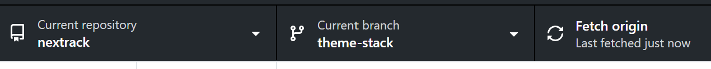
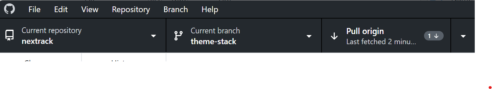
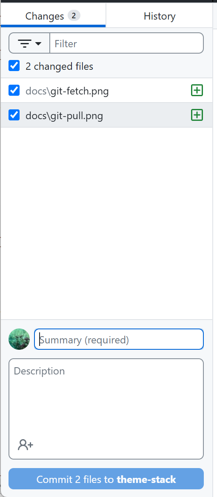

# nextrack - Template Stack

Modules used by this hugo project:
 * Theme [hugo-theme-stack](https://github.com/CaiJimmy/hugo-theme-stack) and his [starter](https://github.com/CaiJimmy/hugo-theme-stack-starter)
 * Shortcode for Image gallery [hugo-shortcode-gallery](https://github.com/mfg92/hugo-shortcode-gallery)
 * Shortcode for gpx tracks [hugo-gpx-shortcode](https://github.com/martinschneider/hugo-gpx-shortcode)
 
## How to work

### On Windows laptop
 The project from github (https://github.com/toffee/nextrack/) is checked out into C:\Users\alina\GitHub
 Always get the latest modification from github. While you have selected *nextrack* as _Current repository_ and *theme-stack* as _Current branch_ click on _Fetch origin_
 
 If there are motification upstream then pull
 
 Now it's safe to start working. After you finish partially or completly your modification commit and push to github.
 For commit you can select what files are part of this commit. Enter a message describing your changes and click _Commit_.
 


### On Jupiter
 Everything is done on jupiter, so connect with Putty to jupiter (192.168.120.5) with your user and password.
 
 The project from github (https://github.com/toffee/nextrack/) is checked out into /home/alina/git/toffee/nexttrack/. 
 
 Change to this directory:
 ```
 cd /home/alina/git/toffee/nexttrack/
 ```
 Use the branch theme-stack:
 ```
 git checkout theme-stack
 ```
 You can list the existing branches:
 ```
 git branch -l
 ```
 See the local status on the project (read what is displayed and try to understand)
 ```
 git status
 ```
 Get the changes from remote (github) repository:
 ```
 git fetch
 git pull
 ```
 Run the server that serves the html pages generated by hugo (the platform that translate md, images, gpx files into html site). Use a specific port (don't use the default one 1313)
 ```
 hugo server --bind=0.0.0.0 --port 1314
 ```
 On windows computer access http://192.168.120.5:1314/ url with a browser to view the generated site.

 Edit/create project files - chenges are automatically detected by "hugo server" and the site will be regenerated. The modification can be seen in browser.


